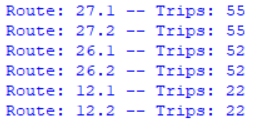

<h1 align="center">
  Transit Scheduler
</h1>


<p align="center">
  <a href="#introduction">Introduction</a> •
  <a href="#use">Use</a> •
  <a href="#gallery">Gallery</a> •
  <a href="#notes">Notes</a> •
  <a href="#related">Related</a> •
  <a href="#license">License</a> •
  <a href="#sources">Sources</a> •
</p>


The transit scheduler is a program which creates schedules for the bus network information provided. This project uses Victoria's BC Transit system data [1][2][3], to output a schedule which passengers can use to effectively plan their travels, and minimize waits and missed connections as much as possible.

## Introduction

These project only implements default Python modules. The project's folder structure is built as follows: 

```bash
├── apps
│   ├── document_maker.py 
│   ├── node.py
│   ├── routes_kml.py
│   ├── schedule_app.py
│   ├── schedule_generator.py
│   └── schedule_output.json
├── bctransit-opendata
│   ├── routes.csv
│   ├── shapes.csv
│   ├── stop_times.csv
│   ├── stops_bctransit.csv
│   ├── trips.csv
├── data
│   ├── buses.csv
│   ├── connections.csv
│   ├── frequency.csv
│   ├── priority.csv
│   ├── routes.csv
│   ├── routes_shape.csv
│   ├── stops.csv
├── TransitGUI
│   ├── src
│   │   ├── **/*.java
│   ├── json-20180130.jar
│   ├── .classpath
│   ├── .gitignore
│   ├── .project
├── LICENSE.md
├── README.md
└── path.kml
```

**apps**: Contains the pyython scripts at the core of the program's functions, to generate and optimize route schedules

**bctransit-opendata**: Contains the downloaded data from BC Transit, which is used to create formatted data for python scripts [1],[2]

**data**: Contains the formatted data for the python scripts, in a way that reduces the need of data formatting in python scripts

**TransitGUI**: Contains the Java GUI application that displays generated route schedules to drivers

## Use

This program first loads all of the relevant data files from the ```data``` directory, and stores it in the ```schedule_generator``` class. It then initializes the ```Schedule_Algorithm``` class, which organizes each route, generates schedules, and optimizes the schedule to minimize the wait time between each bus trip.

## Gallery 

When the routes and stops are first loaded into the ```Schedule_Algorithm``` class, it calculates the routes simply based on the frequency each route should run at for each hour of the day, and stores it:




## Sources

[1] BC Transit, "Open Data", *BC Transit*, 2018. [Online]. Available: https://bctransit.com/*/footer/open-data. [Accessed: Jul. 22, 2018].

[2] BC Transit, "Our Fleet", *BC Transit*, 2018. [Online]. Available: https://bctransit.com/*/about/fleet. [Accessed: Jul. 21, 2018].

[3] Canadian Public Transit Discussion Board, "Victoria Regional Transit System", 2018. [Online]. Available: https://cptdb.ca/wiki/index.php/Victoria_Regional_Transit_System. [Accessed: Jul. 21, 2018].
